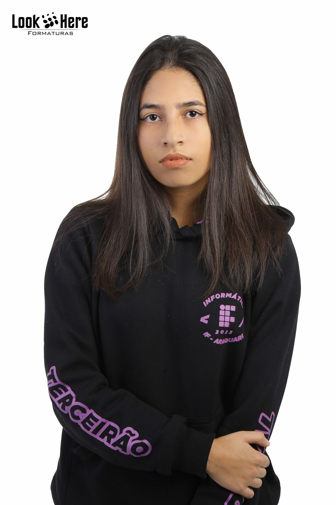
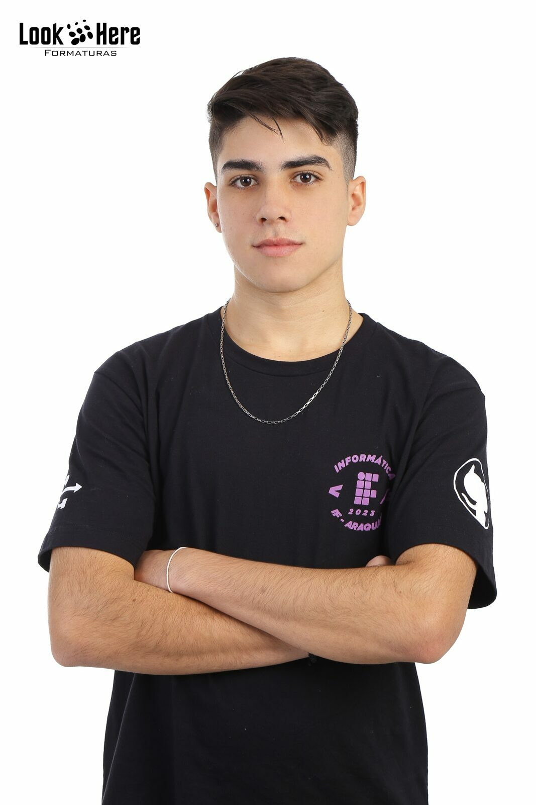

# CodeCrafters

##  Links:
- Backend: https://django-hackathon.4.us-1.fl0.io/
- Frontend: https://hackathonifc.surge.sh/

## 🤝 By

<table>
  <tr>
    <td align="center">
      <a href="https://github.com/aanappaula">
         
        
          <b>Ana Paula de Souza</b>
        
      </a>
    </td>
   <td align="center">
      <a href="https://github.com/AnaLuizaDias">
         
        
          <b>Ana Luiza Dias </b>
        
      </a>
    </td>
    <td align="center">
      <a href="https://github.com/luizatorrens">
         
        
          <b>Luiza Torrens</b>
        
      </a>
    </td>
      <td align="center">
      <a href="https://github.com/PhelipiM">
         
        
          <b>Phelipi Moser</b>
        
      </a>
    </td>
      <td align="center">
      <a href="https://github.com/GuilhermeTamanini">
         
        
          <b>Guilherme Tamanini</b>
        
      </a>
    </td>
    <td align="center">
      <a href="https://github.com/FelipeRotermel">
         
        
          <b>Felipe Rotermel </b>
        
      </a>
    </td>

  </tr>
</table>
